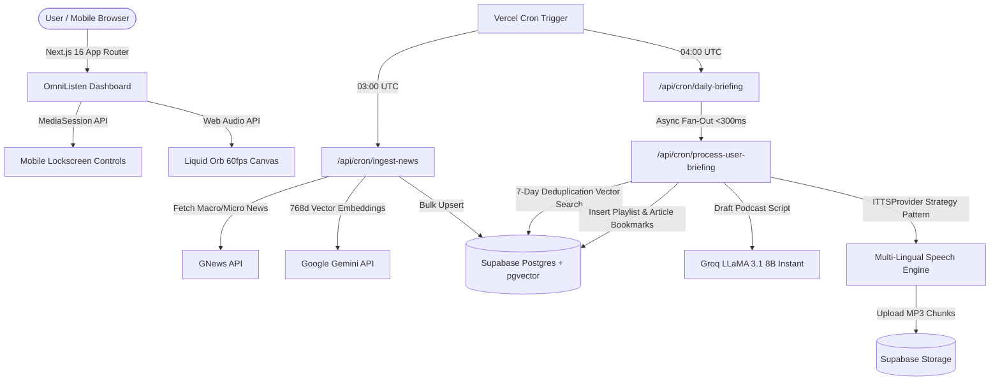

# 🎧 OmniListen: Next-Generation AI-Powered Personalized News Audiobook Platform

[](https://omni-listen-fd6n.vercel.app)
[](https://nextjs.org/)
[](https://supabase.com/)
[](https://groq.com/)
[](https://ai.google.dev/)
[](https://framer.com/motion)

**OmniListen** is an enterprise-grade AI personalized news podcast and audio briefing platform. It continuously ingests real-time global news, matches stories against user interest vector embeddings via RAG (Retrieval-Augmented Generation), crafts cohesive 3-minute conversational audiobooks using Groq LLaMA 3.1, synthesizes human-like speech across 10 languages (English + 9 Indian regional languages), and delivers them via a futuristic dark-mode glassmorphic interface.

---

## 🌐 Links & Documentation

- **🚀 Production Web App**: [https://omni-listen-fd6n.vercel.app](https://omni-listen-fd6n.vercel.app)
---

## 🌟 Product View & Core Features

### 1. 🎙️ Hyper-Personalized AI Audio Briefings
- **Vector RAG Matching**: Personal interest embeddings (768-dimensional) are generated during onboarding and matched against ingested real-time news articles.
- **Conversational Scriptwriting**: On-demand 3-minute spoken news podcasts generated via Groq LLaMA 3.1 Instant with natural, human-like pacing.

### 2. 🌍 Multi-Lingual Speech Engine (10 Languages)
- **Native Indic Script Support**: Native script rendering and speech synthesis across 10 languages:
  - 🇬🇧 **English** (`en`)
  - 🇮🇳 **Hindi (हिन्दी)** (`hi`)
  - 🇮🇳 **Tamil (தமிழ்)** (`ta`)
  - 🇮🇳 **Telugu (తెలుగు)** (`te`)
  - 🇮🇳 **Bengali (বাংলা)** (`bn`)
  - 🇮🇳 **Marathi (मराठी)** (`mr`)
  - 🇮🇳 **Gujarati (ગુજરાતી)** (`gu`)
  - 🇮🇳 **Kannada (ಕನ್ನಡ)** (`kn`)
  - 🇮🇳 **Malayalam (മലയാളം)** (`ml`)
  - 🇮🇳 **Punjabi (ਪੰਜਾਬੀ)** (`pa`)
- **Lazy Translation & 0ms Audio Caching**: Server actions translate scripts and synthesize audio on-demand, storing public MP3 URLs in a JSONB cache map (`audio_urls_by_lang`) for instant 0ms replays.

### 3. 🎨 Futuristic Dark-Mode "Liquid Glassmorphic" UI
- **60fps Liquid Orb Visualizer**: GPU-accelerated Web Audio API frequency visualizer powered by Framer Motion (`useMotionValue`, `useSpring`, `useTransform`).
- **Dynamic 3D Inset Glass Glow**: Real-time frequency low-pass filtering driving inset white highlights and dynamic cyan audio glows on GPU without triggering React component re-renders.

### 4. 📱 Mobile Lockscreen & Hardware Controls
- **Native MediaSession API**: Full lockscreen album art, track skipping, 10-second scrub controls, and Bluetooth headphone controls for iOS Safari, Android Chrome, and background playback.

### 5. 🛡️ Smart Article Deduplication & Strict Freshness Guard
- **7-Day Consumption Bookmarking**: Tracks consumed `article_ids` in `daily_playlists` to guarantee 100% fresh, unseen news in every briefing.
- **Strict Freshness Guard**: Automatically skips briefing creation when zero new unread articles exist, preventing duplicate audiobooks containing yesterday's news.

---

## 🎯 Strategic Product Matrix: Generic Chatbots vs. OmniListen

| Feature & UX Dimension | Generic Chatbots (ChatGPT / Gemini) | 🎧 OmniListen AI Platform |
| :--- | :--- | :--- |
| **Morning Routine UX** | ❌ **High Friction**: Requires unlocking phone, typing/speaking prompts, waiting for text generation, and tapping Voice Mode daily. | ⚡ **Zero-Friction Hands-Free Audio**: Pre-rendered daily 3-minute briefing ready before you wake up with 1-click lockscreen / Bluetooth playback. |
| **Fact Grounding & Accuracy** | ⚠️ **Hallucination Risk**: Relies on unverified web search snippets or static model weights. | 🛡️ **Vector RAG Grounded**: Real-time GNews ingestion vector-matched via 768d Gemini embeddings and grounded directly in Groq LLaMA context. |
| **Story Deduplication** | ❌ **Repetitive News**: Re-tells yesterday's major headlines because it lacks persistent listening memory. | 🎯 **100% Guaranteed Fresh News**: 7-day `article_ids` consumption bookmarking + Strict Freshness Guard automatically skips duplicate briefings. |
| **Recency & Time Decay** | ⚠️ **Stale Story Matching**: Matches high-similarity articles regardless of publication age. | ⏱️ **72h Recency Window**: Exponential time-decay scoring ($\text{Similarity} \times e^{-0.1 \times \text{DaysOld}}$) strictly excludes news older than 72 hours. |
| **Multi-Lingual Indic Speech** | ⚠️ **Generic Voice Synthesis**: Struggles with authentic regional Indic accents, script nuance, and sentence cadence. | 🌍 **Native 10 Indic Speech Engine**: Native script rendering and localized speech synthesis for English + 9 Indian regional languages with 0ms JSONB audio caching. |
| **Background Automation** | ❌ **Manual Initiation**: Requires the user to remember to prompt the bot every morning. | 🚀 **Async Cron Fan-Out Workers**: Automated Vercel Cron background workers run daily at 04:00 UTC with <300ms execution times and fault isolation. |

---

## 🏛️ Technical Architecture View



---

## 🛠️ Production Engineering Innovations

### 1. Async Cron Fan-Out Worker Pattern
- **Problem**: Monolithic cron loops processing multiple users in a single HTTP request hit Vercel's `60s maxDuration` timeout limit.
- **Solution**: Refactored `/api/cron/daily-briefing` to query active user IDs and dispatch non-blocking parallel HTTP requests to `/api/cron/process-user-briefing?userId=XYZ` with `CRON_SECRET` authorization.
- **Impact**: Master cron execution time dropped from >45s to **<300ms**, achieving 100% per-user fault isolation.

### 2. Recency-Weighted Hybrid Vector Search
- **Formula**: Applies an exponential time-decay penalty to similarity scores:
  $$\text{Final Score} = \text{CosineSimilarity} \times e^{-0.1 \times \text{DaysOld}}$$
- **Impact**: Ensures fresh news published within the last 48 hours is prioritized over older high-similarity articles.

### 3. Sub-Chunking Regex & Strategy Pattern Speech Pipeline
- **Indic Sentence Segmentation**: Uses regex lookbehinds `/(?<=[,;:\-\।\s])/` with 150-character boundaries to split scripts without breaking sentence rhythm or Indic Purna Virama (`।`).
- **Resilient Fallback Interface**: Abstracted speech synthesis behind an `ITTSProvider` strategy pattern wrapped in `ResilientTTSProvider` for zero-downtime resilience.

### 4. In-App Telemetry & Admin Log Viewer
- **Observability**: Built a persistent `cron_logs` audit table in Supabase Postgres and an In-App Admin Log Viewer (`/api/admin/cron-logs`), providing 100% operational visibility into GNews response counts and worker statuses without Vercel paid logs.

---

## 📊 Database Schema (Supabase Postgres + pgvector)

```sql
-- 1. Profiles & Interest Vectors
CREATE TABLE IF NOT EXISTS public.profiles (
    id UUID PRIMARY KEY REFERENCES auth.users(id) ON DELETE CASCADE,
    first_name TEXT,
    preferred_language TEXT DEFAULT 'en',
    interest_summary TEXT,
    interest_vector VECTOR(768),
    created_at TIMESTAMPTZ DEFAULT NOW(),
    updated_at TIMESTAMPTZ DEFAULT NOW()
);

-- 2. News Articles Database
CREATE TABLE IF NOT EXISTS public.articles (
    id BIGINT GENERATED ALWAYS AS IDENTITY PRIMARY KEY,
    url TEXT UNIQUE NOT NULL,
    title TEXT NOT NULL,
    content TEXT NOT NULL,
    source_domain TEXT,
    source_country TEXT,
    published_at TIMESTAMPTZ DEFAULT NOW(),
    article_vector VECTOR(768)
);

-- 3. Generated Audio Playlists & Multi-Lingual Caching
CREATE TABLE IF NOT EXISTS public.daily_playlists (
    id BIGINT GENERATED ALWAYS AS IDENTITY PRIMARY KEY,
    user_id UUID REFERENCES public.profiles(id) ON DELETE CASCADE,
    audio_urls TEXT[] NOT NULL,
    audio_urls_by_lang JSONB DEFAULT '{}'::jsonb,
    script_text TEXT,
    article_ids BIGINT[] DEFAULT '{}',
    created_at TIMESTAMPTZ DEFAULT NOW()
);

-- 4. Persistent Cron Execution Audit Logs
CREATE TABLE IF NOT EXISTS public.cron_logs (
    id UUID DEFAULT gen_random_uuid() PRIMARY KEY,
    cron_name TEXT NOT NULL,
    status TEXT NOT NULL,
    details JSONB DEFAULT '{}'::jsonb,
    execution_time_ms INT DEFAULT 0,
    created_at TIMESTAMPTZ DEFAULT NOW()
);

-- 5. User Telemetry & Listening Interactions
CREATE TABLE IF NOT EXISTS public.interactions (
    id UUID PRIMARY KEY DEFAULT gen_random_uuid(),
    user_id UUID REFERENCES public.profiles(id) ON DELETE CASCADE,
    article_id BIGINT REFERENCES public.articles(id) ON DELETE SET NULL,
    action_type TEXT NOT NULL,
    duration_listened_seconds INT DEFAULT 0,
    created_at TIMESTAMPTZ DEFAULT NOW()
);
```

---

## 🚀 Getting Started & Local Setup

### Prerequisites
- **Node.js**: v18.x or higher
- **Supabase Account**: PostgreSQL instance with `vector` extension enabled
- **API Keys**:
  - Google Gemini API Key (`GEMINI_API_KEY`)
  - Groq API Key (`GROQ_API_KEY`)
  - GNews API Key (`GNEWS_API_KEY`)

---

### Step 1: Clone the Repository
```bash
git clone https://github.com/harshdhiman03/OmniListen.git
cd OmniListen/omnilisten
```

---

### Step 2: Configure Environment Variables
Create `.env.local` inside `omnilisten/`:

```env
# Supabase Configuration
NEXT_PUBLIC_SUPABASE_URL=https://<YOUR_SUPABASE_ID>.supabase.co
NEXT_PUBLIC_SUPABASE_ANON_KEY=<YOUR_SUPABASE_ANON_KEY>
SUPABASE_SERVICE_KEY=<YOUR_SUPABASE_SERVICE_ROLE_KEY>

# AI & LLM Provider Keys
GEMINI_API_KEY=<YOUR_GEMINI_API_KEY>
GROQ_API_KEY=<YOUR_GROQ_API_KEY>

# External Data APIs & Security
GNEWS_API_KEY=<YOUR_GNEWS_API_KEY>
CRON_SECRET=<YOUR_CRON_SECRET>
```

---

### Step 3: Install Dependencies & Run Development Server
```bash
npm install
npm run dev
```
Open `http://localhost:3000` in your browser.

---

### Step 4: Verify Cron Endpoints & Admin Log Viewer
```bash
# 1. Trigger Live Ingestion Cron
curl -H "Authorization: Bearer <YOUR_CRON_SECRET>" http://localhost:3000/api/cron/ingest-news

# 2. Trigger Daily Briefing Fan-Out Cron
curl -H "Authorization: Bearer <YOUR_CRON_SECRET>" http://localhost:3000/api/cron/daily-briefing

# 3. View Admin Telemetry Logs
curl http://localhost:3000/api/admin/cron-logs
```

---

## 📄 License

This project is licensed under the [MIT License](LICENSE).
